# ☁️ Azure Weather Dashboard

A minimal, production-ready full-stack weather app built for the cloud. Demonstrates Azure serverless architecture: an **Azure Function** (Python) as the API layer and an **Azure Static Web App** for the frontend, connected with automatic CI/CD via GitHub Actions.

```mermaid
graph TD
    A[👤 User] -->|Search city| B[Azure Static Web App\nVanilla JS + Tailwind]
    B -->|GET /api/weather?city=| C[Azure Function\nPython 3.12]
    C -->|External HTTP request| D[OpenWeatherMap API]
    D -->|Raw JSON| C
    C -->|Normalized JSON| B
    B -->|Rendered cards| A
```



---

## What it is

| Layer | Tech |
|---|---|
| Backend API | Azure Functions (Python 3.12, HTTP trigger) |
| Frontend | Vanilla JS · Tailwind CSS CDN · SPA |
| Hosting | Azure Static Web Apps (free tier) |
| CI/CD | GitHub Actions (push-to-deploy) |
| Data | OpenWeatherMap free API |

**Features:** current conditions, 5-day forecast, dark/light mode (persisted), loading states, error handling, CORS headers, no secrets in repo.

---

## Project Structure

```
azure-weather-dashboard/
├── backend/
│   ├── WeatherFunction/
│   │   ├── __init__.py          # HTTP handler + OpenWeather logic
│   │   └── function.json        # HTTP trigger binding
│   ├── host.json
│   ├── requirements.txt
│   └── local.settings.json.template
├── frontend/
│   ├── index.html               # Single page app
│   ├── js/app.js                # Fetch, render, dark-mode logic
│   └── staticwebapp.config.json # SWA routing rules
├── .github/workflows/
│   └── deploy.yml               # Backend + frontend CI/CD
└── .gitignore
```

---

## How to Run Locally

### Prerequisites
- Python 3.12
- [Azure Functions Core Tools v4](https://learn.microsoft.com/en-us/azure/azure-functions/functions-run-local)
- A free [OpenWeatherMap API key](https://openweathermap.org/api)

### 1. Clone and set up backend

```bash
git clone https://github.com/your-user/azure-weather-dashboard.git
cd azure-weather-dashboard/backend

# Create virtual environment
python -m venv .venv && source .venv/bin/activate   # Windows: .venv\Scripts\activate
pip install -r requirements.txt

# Configure local secrets (never commit this file)
cp local.settings.json.template local.settings.json
# → Edit local.settings.json and set OPENWEATHER_API_KEY
```

### 2. Start the Function App

```bash
# Still inside /backend
func start
# Function available at: http://localhost:7071/api/weather?city=London
```

### 3. Serve the frontend

In a separate terminal, serve the `frontend/` folder with any static server:

```bash
# Python built-in (from /frontend)
cd ../frontend
python -m http.server 3000
# Open http://localhost:3000
```

> **Tip:** The frontend calls `/api/weather` (relative URL). For local dev, temporarily change `API_BASE` in `app.js` to `http://localhost:7071/api/weather` if not using a proxy.

---

## How to Deploy

### One-time Azure resource setup (Azure CLI)

```bash
# Variables – change these
RG="rg-weather-dashboard"
LOCATION="eastus"
STORAGE="stweatherfn001"
FUNCAPP="azure-weather-fn"
SWAAPP="azure-weather-swa"

# 1. Resource group
az group create --name $RG --location $LOCATION

# 2. Storage account (required by Functions)
az storage account create \
  --name $STORAGE --resource-group $RG \
  --location $LOCATION --sku Standard_LRS

# 3. Function App (Python 3.12, Consumption plan)
az functionapp create \
  --name $FUNCAPP --resource-group $RG \
  --storage-account $STORAGE \
  --consumption-plan-location $LOCATION \
  --runtime python --runtime-version 3.12 \
  --functions-version 4 --os-type Linux

# 4. Set the OpenWeather API key as an app setting (secure – not in code)
az functionapp config appsettings set \
  --name $FUNCAPP --resource-group $RG \
  --settings OPENWEATHER_API_KEY="<your_key_here>"

# 5. Static Web App (link to Function App for /api routing)
az staticwebapp create \
  --name $SWAAPP --resource-group $RG \
  --location "eastus2" \
  --linked-backends '[{"backendResourceId":"/subscriptions/<sub>/resourceGroups/'$RG'/providers/Microsoft.Web/sites/'$FUNCAPP'","region":"'$LOCATION'","backendType":"AzureFunctions"}]'
```

### GitHub Secrets

Go to **GitHub → Settings → Secrets and variables → Actions** and add:

| Secret | Where to get it |
|---|---|
| `AZURE_FUNCTIONAPP_PUBLISH_PROFILE` | Azure Portal → Function App → **Get publish profile** |
| `AZURE_STATIC_WEB_APPS_API_TOKEN` | Shown during SWA creation or Portal → Static Web App → **Manage deployment token** |

### Deploy

Push to `main` — GitHub Actions handles the rest automatically.

```bash
git add .
git commit -m "feat: initial deploy"
git push origin main
```

---

## Key Learnings

- **Azure Static Web Apps + linked Function App** provide first-class `/api/*` routing without any CORS configuration or API Gateway.
- **Azure Functions Consumption plan** offers ~1M free executions/month — ideal for portfolio projects.
- **Separating secrets** into Azure App Settings keeps credentials out of source control while making them available as environment variables at runtime.
- **Normalized API responses** in the Function layer decouple the frontend from upstream API changes.
- **GitHub Actions** with `azure/functions-action` and `Azure/static-web-apps-deploy` enables zero-click deploys on every push.

---

## License

MIT © 2025
